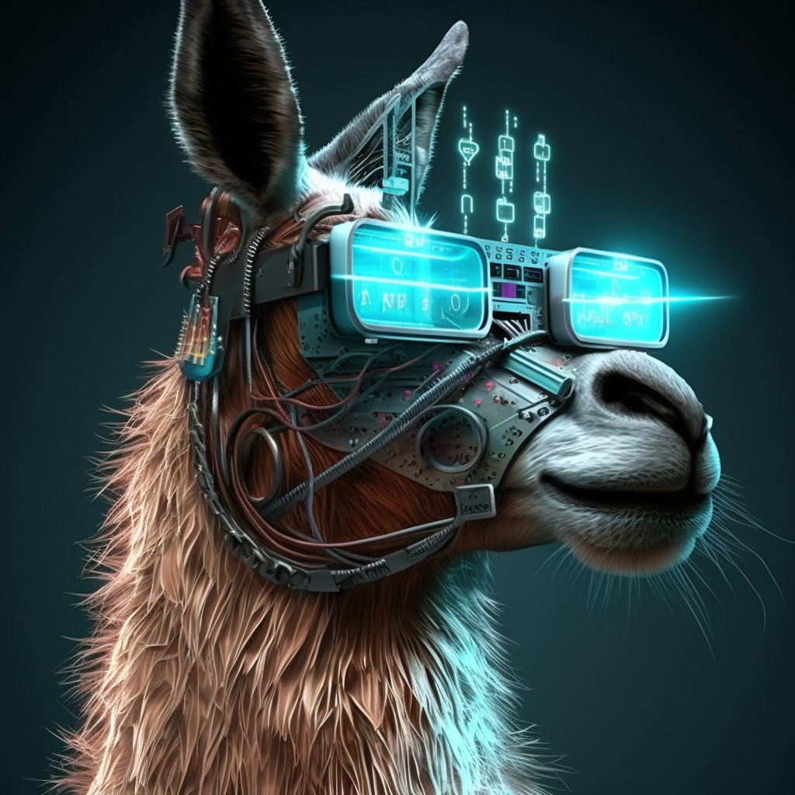
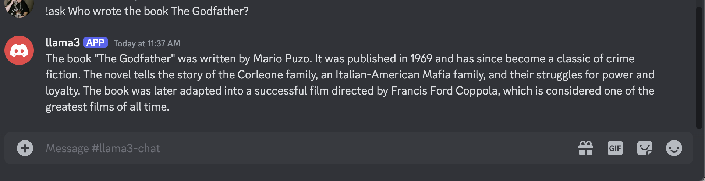

# Llama3 Discord Bot

<p align="center">
  
</p>

This project integrates Llama3 8B, an open-source AI model, with a Discord bot. It allows users to interact with Llama3 through Discord messages.

## Features:

- Runs Llama3 8B model locally
- Integrates with Discord for user interaction
- Responds to user queries in real-time

## Prerequisites:

- Python 3.x
- Llama3 8B model set up locally
- Discord bot token

## Setup:

1. Download and Install Ollama:
    - Follow the instructions at [Ollama](https://ollama.com/)
    - Once installed, running the following command in terminal will download the 8B model:
    ```
    ollama run llama3
    ```
    Note: This will download and use the 4.7 GB 8B parameter model as the default. If your machine has more compute power, feel free to specify larger models.

2. Setup the Python Env:
    - There is a script provided named `setup_env.sh` that will create a pip env named `llama3_env` and download the dependencies.
    - To run the set up script, first ensure the file is executable:
    ```
    chmod +x setup_env.sh
    ```
    - Alternatively, feel free to set up your own env and just run the following command to download the dependencies:
    ```
    pip install -r requirements.txt
    ```
    - In either case, just make sure you activate the env using:
    ```
    source llama3_env/bin/activate
    ```

3. Set up Your Discord Bot:
   - Go to the [Discord Developer Portal](https://discord.com/developers/applications)
   - Click "New Application" and give it a name
   - Go to the "Bot" tab and click "Add Bot"
   - Under the "Token" section, click "Copy" to copy your bot token
   - In the "OAuth2" tab, select "bot" under "Scopes" and choose necessary permissions
   - Use the generated URL to invite the bot to your server

4. Create a `config.py` file in the project root with your Discord bot token:
   ```python
   DISCORD_BOT_TOKEN = 'your_discord_bot_token_here'
    ```

5. Usage:
    - Run the Discord bot:
    ```
    python3 discord_bot.py
    ```
    - In the Discord server, use the command `!ask` to send queries:
    ```
    !ask Who wrote the book The Godfather?
    ```
<p align="center">
  
</p>

6. How it works:
    - The user sends a query in Discord using the `!ask` command.
    - The bot sends this query to the local Llama3 model running on your machine.
    - Llama3 processes the query and generates a repsonse.
    - The bot sends the response back to the Discord channel.

